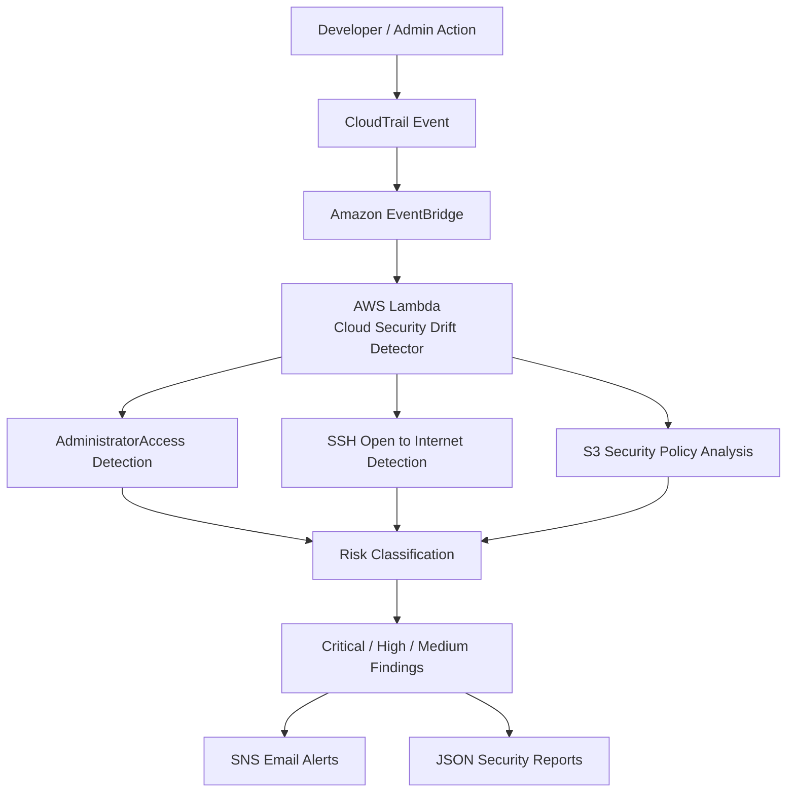

# AWS Cloud Security Drift Detective

## Overview

AWS Cloud Security Drift Detective is a cloud security monitoring solution that detects risky configuration changes across AWS environments.

The project analyzes AWS CloudTrail events and identifies security misconfigurations such as:

* IAM Privilege Escalation
* AdministratorAccess Policy Attachments
* Public Security Group Exposure
* Public S3 Access Risks

## Features

* Detects IAM privilege escalation attempts
* Detects AdministratorAccess policy attachments
* Detects SSH (Port 22) exposed to the internet
* Detects risky Security Group changes
* Generates security findings with severity levels
* Provides remediation recommendations
* Supports local testing using sample CloudTrail events

## Technology Stack

* Python
* AWS CloudTrail
* AWS Lambda
* Amazon EventBridge
* Amazon SNS

## Project Structure

aws-cloud-security-drift-detective/

├── detector.py

├── lambda_function.py

├── requirements.txt

├── scripts/

│ └── local_test.py

├── samples/

│ ├── sample_iam_event.json

│ ├── sample_s3_event.json

│ └── sample_sg_event.json

## Sample Findings

Critical – AdministratorAccess Policy Attached

High – SSH Open to Internet (0.0.0.0/0)

## Future Improvements

* Public S3 Bucket Detection
* Root User Activity Detection
* MFA Disabled Detection
* CloudTrail Tampering Detection
* HTML Security Dashboard

##Architecture Diagram

##Screenshots

Screenshot 1 – IAM Detection

Screenshot 2 – Security Group Detection

Screenshot 3 – Full Output

## Author

Deepak Sundhar B
