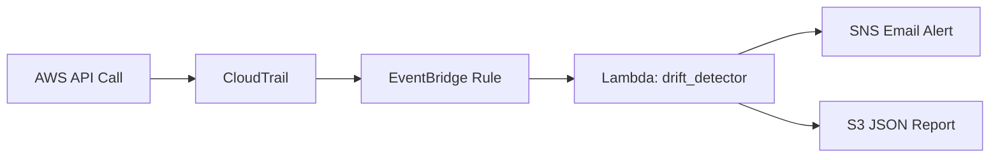

# AWS Cloud Security Drift Detective

> **CloudTrail + EventBridge + Lambda + SNS** — Real-time detection of risky AWS configuration changes across **IAM**, **S3**, and **Security Groups**.

---

## What This Project Does

| Component | Role |
|-----------|------|
| **CloudTrail** | Records every AWS API call (who changed what, when) |
| **EventBridge** | Filters CloudTrail events and routes risky ones to Lambda |
| **Lambda (Python)** | Analyzes events, detects security drift, triggers alerts |
| **SNS** | Sends email alerts with findings and remediation steps |
| **S3** | Stores JSON security reports for audit trail |

### Detected Risks

| Service | What It Detects | Severity |
|---------|----------------|----------|
| **IAM** | AdministratorAccess attached, MFA removed, new users/keys | Critical–Medium |
| **S3** | Public bucket policy/ACL, encryption removed, public access block disabled | Critical–Medium |
| **Security Groups** | SSH/RDP open to 0.0.0.0/0, all traffic from internet | Critical–High |

---

## Architecture



**Flow:**
1. Someone changes an IAM policy, S3 bucket, or Security Group
2. CloudTrail logs the API call
3. EventBridge matches the event against our rule
4. Lambda analyzes it for security risks
5. If risky → SNS email alert + S3 report saved

---

## Project Structure

```
aws-cloud-security-drift-detective/
├── lambda/drift_detector/       # Lambda function code
│   ├── handler.py               # Main entry point
│   ├── alert_manager.py         # SNS alerts + S3 reports
│   └── analyzers/
│       ├── iam_analyzer.py      # IAM drift detection
│       ├── s3_analyzer.py       # S3 drift detection
│       └── sg_analyzer.py       # Security Group drift detection
├── infrastructure/
│   └── template.yaml            # CloudFormation (creates all AWS resources)
├── events/                      # Sample CloudTrail events for testing
├── scripts/
│   ├── local_test.py            # Test locally without AWS
│   └── deploy.ps1               # One-command AWS deployment
├── run_local_test.bat           # Double-click to test locally
└── README.md
```

---

## Quick Start (3 Easy Steps)

### Step 1 — Test Locally (No AWS Needed)

```powershell
cd aws-cloud-security-drift-detective
python scripts\local_test.py
```

Or double-click **`run_local_test.bat`**

You'll see detected risks from 3 sample events (IAM, S3, Security Group).

### Step 2 — Deploy to AWS

**Prerequisites:**
- AWS account with admin access
- [AWS CLI](https://aws.amazon.com/cli/) installed and configured (`aws configure`)

```powershell
.\scripts\deploy.ps1 -Email "your-email@example.com" -Region "us-east-1"
```

This creates: Lambda, EventBridge rule, SNS topic, S3 reports bucket.

### Step 3 — Confirm & Enable

1. **Check your email** → click **Confirm subscription** on the SNS email
2. **Enable EventBridge on CloudTrail:**
   - AWS Console → CloudTrail → Trails → your trail → Edit
   - Turn **EventBridge** → **ON**
3. Done! Changes to IAM/S3/SG now trigger alerts.

---

## Manual AWS Console Setup (Alternative)

If you prefer clicking instead of scripts:

### 1. Create SNS Topic
- SNS → Topics → Create → Name: `security-drift-alerts`
- Create subscription → Email → enter your email → Confirm

### 2. Create Lambda Function
- Lambda → Create → Python 3.11 → Name: `security-drift-detector`
- Upload code from `lambda/drift_detector/` as zip
- Environment variables:
  - `SNS_TOPIC_ARN` = your SNS topic ARN
  - `REPORTS_BUCKET` = your S3 bucket name

### 3. Create EventBridge Rule
- EventBridge → Rules → Create
- Event pattern → Custom:
```json
{
  "source": ["aws.iam", "aws.s3", "aws.ec2"],
  "detail-type": ["AWS API Call via CloudTrail"],
  "detail": {
    "eventSource": ["iam.amazonaws.com", "s3.amazonaws.com", "ec2.amazonaws.com"]
  }
}
```
- Target → Lambda → `security-drift-detector`

### 4. Enable CloudTrail EventBridge
- CloudTrail → Trails → Edit → EventBridge: ON

---

## Sample Alert Email

```
============================================================
AWS CLOUD SECURITY DRIFT DETECTIVE — ALERT
============================================================

Event:      AttachUserPolicy
Time:       2026-06-09T10:30:00Z
Region:     us-east-1
Account:    123456789012
Actor:      arn:aws:iam::123456789012:user/admin-user

FINDINGS (1):
------------------------------------------------------------

1. [Critical] AdministratorAccess Policy Attached
   Service:    IAM
   Resource:   developer-john
   Details:    Actor attached AdministratorAccess to 'developer-john'
   Fix:        Remove AdministratorAccess. Use least-privilege policies.
```

---

## File & Function Reference

### `lambda/drift_detector/handler.py`
| Function | Purpose |
|----------|---------|
| `lambda_handler()` | Receives EventBridge event, routes to analyzer, sends alerts |

### `lambda/drift_detector/analyzers/iam_analyzer.py`
| Function | Purpose |
|----------|---------|
| `analyze_iam_event()` | Detects admin policy attachment, MFA removal, new users |

### `lambda/drift_detector/analyzers/s3_analyzer.py`
| Function | Purpose |
|----------|---------|
| `analyze_s3_event()` | Detects public buckets, encryption removal |

### `lambda/drift_detector/analyzers/sg_analyzer.py`
| Function | Purpose |
|----------|---------|
| `analyze_sg_event()` | Detects SSH/RDP/all-traffic open to internet |

### `lambda/drift_detector/alert_manager.py`
| Function | Purpose |
|----------|---------|
| `send_sns_alert()` | Publishes formatted alert to SNS |
| `save_report()` | Saves JSON report to S3 |

---

## Interview Questions & Answers

**Q1: What is security configuration drift?**
> When AWS resources deviate from a secure baseline over time — e.g., a security group opened to the internet, or admin access granted to a user.

**Q2: Why use EventBridge instead of polling?**
> EventBridge reacts in real-time (seconds) when CloudTrail logs an API call. Polling would be slower, more expensive, and miss the moment of change.

**Q3: What is CloudTrail?**
> AWS service that logs all API calls — who did what, when, from where. Essential for security auditing and incident response.

**Q4: How does Lambda fit in?**
> Lambda runs our Python analysis code only when a matching event occurs. No servers to manage, pay only per invocation (~$0.0000002 per request).

**Q5: Why SNS for alerts?**
> SNS is a pub/sub messaging service. It supports email, SMS, Slack (via HTTPS), and Lambda. Decouples detection from notification.

**Q6: What happens if Lambda fails?**
> EventBridge retries automatically. Failed invocations appear in CloudWatch Logs. Set up a Dead Letter Queue (DLQ) for production.

**Q7: How is this different from AWS Config?**
> Config continuously evaluates resource state against rules. This project reacts to *changes in real-time* via CloudTrail events — complementary, not a replacement.

**Q8: What IAM permissions does the Lambda need?**
> `sns:Publish` on the alert topic, `s3:PutObject` on the reports bucket, plus basic Lambda execution role for CloudWatch Logs.

---

## Cost Estimate

| Service | Free Tier | Typical Cost |
|---------|-----------|-------------|
| CloudTrail | 1 trail free | $0 (management events) |
| EventBridge | 1M events/month free | ~$0 |
| Lambda | 1M requests/month free | ~$0 |
| SNS | 1,000 emails/month free | ~$0 |
| S3 | 5 GB free | ~$0.01/month |

**Total for learning/testing: essentially free.**

---

## 2-Week Learning Plan

| Day | Task |
|-----|------|
| 1–2 | Run `local_test.py`, read all analyzer code |
| 3–4 | Study CloudTrail event format, modify a sample event |
| 5–6 | Deploy to AWS with `deploy.ps1` |
| 7–8 | Trigger real changes (create SG rule), verify alerts |
| 9–10 | Add a new analyzer (e.g., RDS public snapshots) |
| 11–12 | Practice interview Q&A, add to resume/GitHub |

---

## Resume Bullet Points

```
• Built an AWS security monitoring solution to detect risky configuration 
  changes across IAM, S3, and Security Groups.

• Leveraged CloudTrail, EventBridge, and Python-based AWS Lambda functions 
  to identify and analyze security misconfigurations in real time.

• Implemented SNS alerts and S3-stored security reports highlighting 
  detected risks and remediation steps.
```

---

**Built for cybersecurity beginners | CloudTrail + EventBridge + Lambda + SNS + Python**
